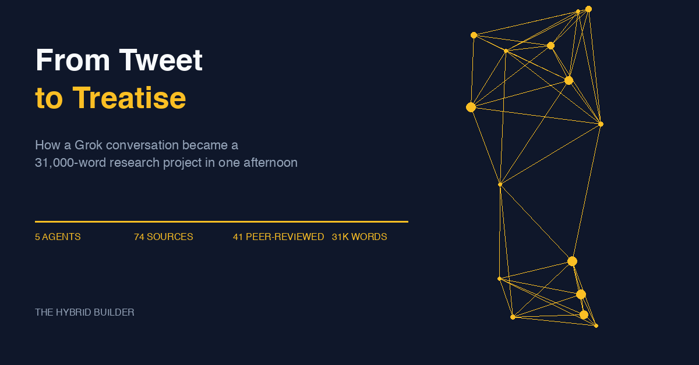

# Grit-CART: From Tweet to Treatise

**How a Grok conversation became a 31,000-word, 74-source research project in one afternoon.**

Read the full article on Substack: **[From Tweet to Treatise](https://chatwithgpt.substack.com/p/from-tweet-to-treatise-how-a-grok)**

---

## What Is This?

This repository contains the complete research corpus behind the Grit-CART framework — a dispositional toolkit for AI-era entrepreneurship and intrapreneurship education, built from Vinod Khosla's four traits (curiosity, agency, risk-taking, taste) and Angela Duckworth's grit research.

It started with [a tweet](https://x.com/vkhosla/status/2022887136803029331), became [a Grok conversation](https://x.com/i/grok/share/5c6e617391a14f59a8551d749ab7060c), and was then rigorously evaluated by five parallel AI agents — each with a different critical lens — in a single afternoon session.

## Repository Contents

### Source Material
- **[grok-conversation-grit-cart.md](grok-conversation-grit-cart.md)** — Full transcript of the original 9-exchange Grok conversation that produced the Grit-CART framework

### Five-Agent Critical Evaluation
Each agent ran independently with web research access, conducting ~50 searches total across 74 unique sources (41 peer-reviewed):

| # | Evaluation | Focus |
|---|-----------|-------|
| 1 | [Theoretical Rigor](evaluations/01-theoretical-rigor.md) | Fact-checking empirical claims, verifying effect sizes, identifying cherry-picked evidence |
| 2 | [Pedagogical Value](evaluations/02-pedagogical-value.md) | Teachability, case study quality, comparison to established frameworks |
| 3 | [Practical Applicability](evaluations/03-practical-applicability.md) | AI market reality check, startup/intrapreneur failure modes, actionability |
| 4 | [Blind Spots & Biases](evaluations/04-blind-spots-biases.md) | Individualism bias, cultural assumptions, gender, neurodiversity, toxic positivity |
| 5 | [Strengthened Framework (CART 2.0)](evaluations/05-strengthened-framework.md) | Redesigned cyclical model, four-layer ecosystem, rubrics, 4-week syllabus |

### Synthesis & Research
- **[Critical Evaluation Synthesis](evaluations/critical-evaluation-synthesis.md)** — Cross-agent findings and unanimous conclusions
- **[Growth Mindset Research Notes](growth-mindset-grit-research-notes.md)** — Deep dive into Dweck-Duckworth collaboration, triggered by a human-in-the-loop observation

### Article
- **[From Tweet to Treatise](articles/2026-02-15-from-tweet-to-treatise.md)** — The Hybrid Builder newsletter article describing the entire process

## The Process

```
Khosla tweet → Grok conversation → Chrome extraction → 5 parallel agent evaluations
    → synthesis → human notices gap → 6th agent (growth mindset) → integration → article
```

Total active research time: ~30 minutes. Output: ~31,500 words across 8 documents.

## Session Transcript

This project was built during a live collaboration session with Claude.
[View the full conversation](https://gisthost.github.io/?2cd9978c800f0865106e0629d9305ba0/index.html) to see how it came together.

---

*Part of [The Hybrid Builder](https://chatwithgpt.substack.com/s/the-hybrid-builder), a series documenting real AI-human collaborations with full transparency about process, limitations, and what actually works.*
